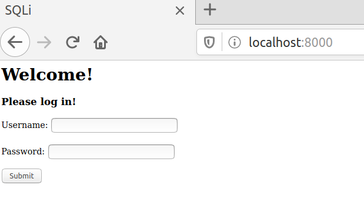
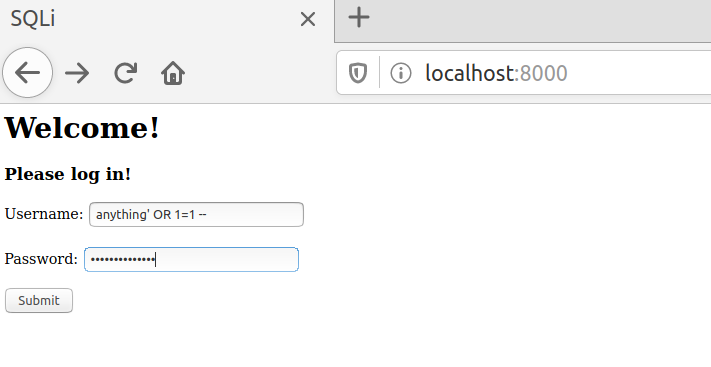
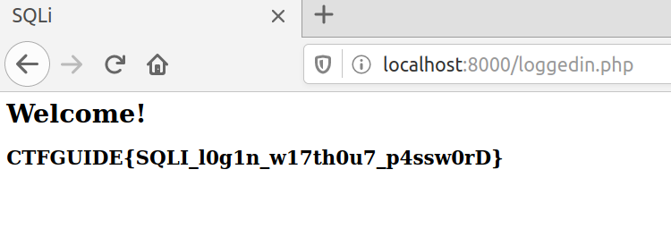

# Web Exploitation
On web exploitation challenges, the contestants are usually given an address to a vulnerable web application on which they can try to exploit those vulnerabilities to obtain the flags. The locations of the flags on web exploitation challenges may vary according to the web's vulnerability. One challenge may require the leakage of database via unsanitized SQL queries, another may require full control of the host/server system. Typical web vulnerabilities include SQL Injection (SQLI), Local File Inclusion (LFI), Cross-Site Scripting (XSS), Server-Side Template Injection (SSTI), and Remote Code Execution (RCE).

## Table of Contents
- [Introduction](../introduction.md)
- **[Web Exploitation](../web/web.md)**
- [Digital Forensics](../foren/foren.md)
- [Cryptography](../crypto/crypto.md)
- [Binary Exploitation](../pwn/pwn.md)
- [Reverse Engineering](../rev/rev.md)

## Tools
The tools you might need to solve Web problems:
- [Burp Suite](https://portswigger.net/burp) - to intercept, examine, and repeat requests.
- [curl](https://curl.haxx.se/) - to make requests via CLI.
- python's [requests](https://requests.readthedocs.io/en/master/) - to make scripted requests.
- etc.

## Example Problem
You can find the files [here](./example/README.md).

Follow the instruction to setup the challenge server.

Notice that in the **real** CTF, the contestants are **not given any files**, just the address of the web to connect to.

## How to Solve
### Observation

First off, try connecting to the *remote* server:



Seems that the web wants us to log in without any credentials given to us.

### Solve
The problem description and the web title indicates that there is an SQL Injection vulnerability. We can utilize this to log ourselves in without any credentials.

We can guess that the code for logging in is using an unfiltered SQL query. We can expect it to be something like this.
```
SELECT * FROM users WHERE username='$INPUT_USERNAME' AND password='$INPUT_PASSWORD'
```
Or simply, select all users which has the username `$INPUT_USERNAME` and password `$INPUT_PASSWORD`. If that query returns a match, we are logged in.

To make sure the query returns a match without knowing the actual username and password in the database, we can alter the query itself by using SQLI vulnerability.

Note that if the web filters out our input (e.g. by using prepared statements), this vulnerability would not exist.

The query we want is something like this.
```
SELECT * FROM users WHERE username='any' OR TRUE
```
Any result from the `WHERE username='any'` would not matter because our query will always return `TRUE`.

Remember that the fields we can control are the username `$INPUT_USERNAME` and password `$INPUT_PASSWORD`. One way to do so is to close out the SQL String `'`, adding the `OR TRUE` bit, and commenting out the rest.

We can input the username like this. Note that `'` is to close out the string (in some challenges it might be `"` instead), `OR 1=1` is equivalent to `OR TRUE` (may vary for different SQL languages), ` -- ` is SQL comment (also may vary).
```
anything' OR 1=1 -- 
```




That input will result in this SQL Query.

The query we want is something like this.
```
SELECT * FROM users WHERE username='anything' OR 1=1 -- ' AND password='any_password'
|______________will always return true_________________|_______commented out________|
```

Use that as a username and anything as the password (does not matter since it will be commented out anyways), and we'll get our login, and our flag!


